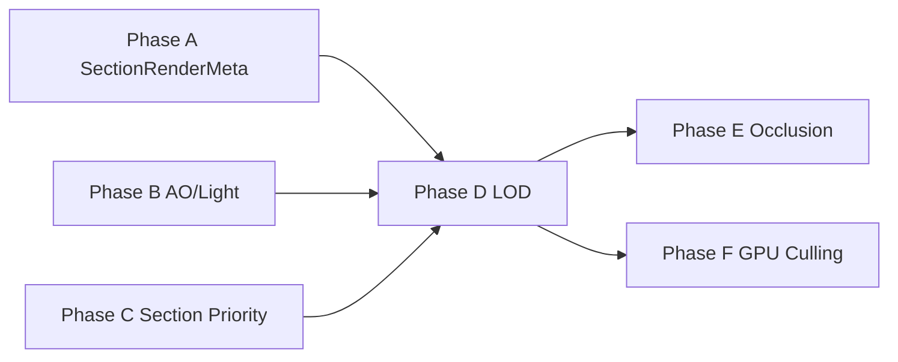

# Phase D — Chunk LOD — Design

**Status:** Implemented (2026-06-04) — commits `997f5e7`, `8e80324`, `Phase D: LOD presets + docs`
**Roadmap:** `2026-06-04-rendering-performance-roadmap-design.md` (Phase D)
**Bezug:** `2026-06-03-voxel-engine-design.md` §11 (LOD0), §12 (Meshing), §13 (Renderer), §14 (Streaming); Phasen A/B/C Specs

## Ziel

Weite Sicht (**32+ Chunk-Horizont**) bei stabiler Frame-Zeit: nahe Terrain bleibt **LOD0** (bestehende Section-Meshes, Wasser, AO/Light), mittlere Distanz wechselt auf **LOD1** (gröbere Chunk-Meshes, ~2 m effektive Voxel), sehr ferne Flächen optional **Farb-Impostors** (D.2).

Erfolgskriterien (manuell, nach Implementierung):

1. Bei `render_radius_xz ≥ 20` bleibt Frame-Zeit stabil; ImGui zeigt deutlich weniger LOD0-Draws und messbare LOD1-Nutzung.
2. Shoreline: Wasser und Ufer bleiben LOD0 — keine „verschwommene“ Küstenlinie ohne Wasserpass.
3. Streaming-Rand: fehlende Nachbarn → konservativ LOD0 (kein Loch).
4. Origin-Rebase: nur `render_origin` ändert sich — LOD-Meshes werden nicht invalidiert.

---

## Scope

### In Scope (D.1 — Pflicht für Phase D)

| Thema | Inhalt |
|-------|--------|
| LOD-Auswahl | Distanz + Hysterese pro Chunk; nutzt `focus_world` / `render_origin` |
| LOD1-Geometrie | Ein **opakes** Chunk-Mesh pro `ChunkCoord` (32³ → 16³ downsampled greedy) |
| Downsample | 2×2×2 Zellen → 1 grober Zelltyp (konservativ für Opak) |
| Wasser-Ausnahme | Chunks mit Wasser oder Küsten-Nähe → **voller LOD0** (opaque + water Sections) |
| Pipeline | Mesh-Job, GPU-Alloc, Upload, `build_snapshot` — analog Phase C, eigene Budgets |
| Vertex-Space | LOD1: **coarse 0..16** in `pack_vertex` + **`vertex_scale = 2`** im Draw-Push-Constant (kein 32 in Pack-Bits) |
| LOD-Wechsel | Sichtbare GPU-Repräsentation bis Ersatz `mesh_ready` **und** `gpu_uploaded` (stale-Slot wie Phase C) |
| Normals / Licht | Flächen-Normale wie LOD0; Licht = Mittel der 8 Feinzellen; AO = `3` (kein Fein-AO) |
| Metadaten | `ChunkRenderMeta` (z. B. `has_water`) + bestehendes `SectionRenderMeta` (Phase A) |
| Observability | ImGui: LOD0/LOD1 draw counts, pending LOD1 jobs, skipped water-border |

### In Scope (D.2 — optional, gleiche Phase wenn Zeit, sonst Follow-up-PR)

| Thema | Inhalt |
|-------|--------|
| Far-Impostors | Pro Chunk ein farbiger Billboard/Quad (dominante Oberflächenfarbe + Höhe), ab LOD2-Distanz |
| Draw-Distanz | `kMaxDrawDistance` skaliert mit `StreamingConfig` / `RenderPreset` |

### Out of Scope

- **LOD2** (128³ / 4 m) und echte **64³-LOD1-Chunks** über mehrere LOD0-Chunks (Haupt-Spec-Tabelle — spätere Phase)
- Voxel-Daten LOD1/2 im `ChunkStore` (nur **LOD0** persistiert/generiert)
- Transvoxel / Dual Contouring
- GPU-Driven LOD (Phase F)
- Software-Occlusion über Konnektivität (Phase E) — LOD1 kann `is_empty` Chunks überspringen, aber kein Cave-BFS
- enkiTS-Thread-Prioritäten, Cross-Queue-Priorität (wie Phase C)
- MP-Sync / Save von LOD-Meshes
- Änderung des 8-Byte-`TerrainVertex`-Layouts (Push-Constant + `terrain.vert`/`water.vert` **`vertex_scale`** ist erlaubt)
- Nachbar-aware LOD1-Face-Culling zwischen Chunks (spätere Optimierung)

---

## D0. Ist-Zustand (nach A/B/C)

- Pro Section: `GreedyMesher::mesh_section` → eigene GPU-Slots, bis zu 8 Draws/Chunk.
- `build_snapshot`: Frustum + festes `kMaxDrawDistance = 384` Blöcke (~12 Chunks), Caps `kMaxOpaqueDrawSections = 512`.
- `kMeshChunkRadius = 6` für Mesh-Scheduling; keine LOD-Stufe.
- `SectionRenderMeta` + `empty_skip` / `occluded_skip` (Phase A); Section-Priority (Phase C).
- Haupt-Spec definiert LOD-Stufen 0/1/2, implementiert ist nur LOD0.

---

## D1. LOD-Stufen (Implementierungsmodell)

Abweichung von der Haupt-Spec-Tabelle bewusst **inkrementell**: D.1 implementiert LOD1 **innerhalb** eines LOD0-Chunks (2 m Zellgröße), nicht das Zusammenführen von 2×2×2 LOD0-Chunks zu einem 64³-Speicherobjekt.

| Stufe | Geometrie | Voxel-Quelle | Draw-Einheit |
|-------|-----------|--------------|--------------|
| **LOD0** | 16³ greedy / Section | `Section` + `border` | bis 8× `DrawSection` / Chunk (opaque + water) |
| **LOD1** | 16³ greedy / Chunk (stride 2) | alle 8 Sections eines `Chunk` | 1× `DrawSection` opaque / Chunk |
| **LOD2** (D.2) | Far-Impostor | aggregierte Farbe/Höhe | 1× Impostor-Draw / Chunk |

Spätere Phase kann LOD1 auf **64³-Multi-Chunk-Zellen** umstellen, ohne die Distanz-Auswahl-API zu brechen (`TerrainLodLevel` enum bleibt).

---

## D2. Downsample (LOD1-Voxel)

### Grobe Zelle

Für jede grobe Position `(gx, gy, gz)` mit `gx,gy,gz ∈ [0, 15]`:

- Feinbereich: `fx = gx*2 + {0,1}`, analog `fy`, `fz` (8 Feinzellen).

### Opak

```
opaque_coarse(gx,gy,gz) = ANY opaque_solid in 2×2×2 fine cells
```

Konservativ: dünne Felsnadeln werden „aufgebläht“ — akzeptabel in mittlerer Distanz.

### Wasser

```
water_coarse(gx,gy,gz) = ANY water in 2×2×2
```

Wasser fließt in **LOD1-Opaque-Mesh nicht ein** (separater Pass entfällt in D.1). Stattdessen erzwingt Wasser **LOD0** für den ganzen Chunk (siehe D4).

### Licht (LOD1)

`sky` / `block` = Durchschnitt der 8 Feinzellen (integer mean). Ausreichend für Fernsicht.

### AO (LOD1)

`vert.ao = 3` überall (wie Wasser in Phase B) — kein `corner_ao` auf downsampled Grid in D.1.

---

## D3. LOD-Auswahl

### Metrik

Horizontale Distanz Chunk-Mitte ↔ `focus_world` (XZ), analog `section_mesh_distance_sq`, aber auf **Chunk-Ebene**:

```cpp
inline float chunk_horizontal_distance_sq(ChunkCoord coord, glm::vec3 focus_world);
```

Y wird für Survival-Streaming bereits über vertikale Radien begrenzt; LOD-Bänder primär XZ.

### Schwellen (Default, TOML/`RenderPreset` später)

| Band | Horizontal-Distanz (Blöcke) | Render |
|------|----------------------------|--------|
| Nah | `< lod0_far` (z. B. 96 = 3 Chunks) | LOD0 |
| Mitte | `lod0_far` … `lod1_far` (z. B. 96–512) | LOD1 opaque |
| Fern | `≥ lod1_far` (D.2) | Impostor oder nichts |

**Hysterese** (verhindert Flackern):

- Wechsel LOD0 → LOD1 bei `dist ≥ lod0_far + hysteresis_out`
- Wechsel LOD1 → LOD0 bei `dist < lod0_far - hysteresis_in`
- Analog für LOD1 ↔ LOD2 (D.2)

Zustand pro Chunk in `ChunkMeshState::active_lod` (oder separater Cache), nur CPU.

### Konservativ am Streaming-Rand

Wenn **irgendeine** der 8 Sections:

- Nachbar-`SectionBorderCache` unvollständig / Nachbar-Chunk nicht geladen / `pending_unload` → Chunk bleibt **LOD0** (volle Detail-Sections, kein LOD1-Mesh in Snapshot).

Das erweitert die Phase-A-Regel von Section- auf Chunk-Ebene.

---

## D4. Wasser-Grenze (Pflicht)

### Chunk-Flag

```cpp
struct ChunkRenderMeta {
    bool has_water = false;  // irgendein renderbares Wasser im 32³-Chunk
};
```

`recompute_chunk_render_meta(Chunk&)` bei Load, Worldgen, `write_block` (wenn Block Wasser betrifft oder Palette sich ändert).

### Küsten-Puffer

Zusätzlich **LOD0-Pflicht** (`force_lod0_water_border`), wenn:

- `has_water` auf diesem Chunk, **oder**
- ein **geladener** Nachbar-Chunk in ±1 XZ hat `has_water`.

**Nicht** ausreichend für LOD0 allein: Nachbar ist **noch nicht geladen** (kein Wasser-Nachweis). Land-Chunk am Stream-Rand darf LOD1 wählen, sobald Section-Borders vollständig sind (siehe D3).

### Interaktion Streaming-Rand vs. Wasser

Zwei **unabhängige** LOD0-Gründe (OR — einer reicht):

| Regel | Bedingung | Zweck |
|-------|-----------|--------|
| **Streaming-edge** | Irgendeine Section: Nachbar-Chunk fehlt / `pending_unload` / `border.dirty` unhealed | Keine Löcher, konservativ nah am Spieler |
| **Water-border** | `has_water` self oder geladener XZ-Nachbar mit `has_water` | Shoreline + Water-Pass |

Folge am Rand: Chunk kann kurz LOD1 sein, obwohl der **noch nicht geladene** Nachbar später Wasser enthält → möglicher Pop zu LOD0. Akzeptiert in D.1 (selten, nur Rand-Transition). **Streaming-edge** verhindert das häufigere Loch-Szenario.

### Draw-Verhalten

| Chunk-Zustand | Opaque | Water |
|---------------|--------|-------|
| LOD0-Pflicht (Wasser/ Küste) | Section LOD0 | Section LOD0 |
| LOD1-fähig | 1× Chunk LOD1 mesh | **kein** Water-Draw (kein Wasser im Chunk) |
| LOD0 nah | Section LOD0 | wie heute |

---

## D5. Meshing & Speicher

### D5.1 Vertex-Koordinaten (fest — Blocker gelöst)

**Fakt:** `pack_vertex` / `terrain.vert` nutzen **5 Bit** pro Achse (`POS_MASK = 31`). Gültige gepackte Koordinaten: **0..31**. `pack_vertex(32, …)` maskiert zu **0** — **verboten** für LOD1.

| Raum | Bereich | Verwendung |
|------|---------|------------|
| LOD0 Section | 0..16 in `pack_vertex` | 1 m/Voxel, `model_translation` = Chunk+Section−origin |
| LOD1 Coarse | 0..16 in `pack_vertex` | 1 Einheit = 2 m Welt; **kein** Wert > 16 auf Chunk-Mesh-Quads |
| LOD1 Welt | 0..32 m im Chunk | `world = model_translation + vec3(x,y,z) * vertex_scale` |

**Festlegung D.1:**

1. `mesh_chunk_lod1` schreibt Vertices in **Coarse-Space 0..16** (gleiche Semantik wie Section-Greedy: 16³ Zellen, Ecken bis 16).
2. `DrawSection` / `DrawPushConstants` für LOD1: `vertex_scale = 2.0f`, `model_translation = chunk_origin_world − render_origin` (ohne Section-Offset).
3. `terrain.vert` / `water.vert` (nur Push-Block):

```glsl
layout(push_constant) uniform Push {
    vec3 model_translation;
    float vertex_scale;  // LOD0 = 1.0, LOD1 = 2.0
} push;
// world = push.model_translation + vec3(x, y, z) * push.vertex_scale;
```

4. `cull_min/max` für LOD1: `model_translation` .. `model_translation + vec3(32)` (Welt-AABB des Chunks).

**Pflicht-Tests vor Mesher-Merge:**

```cpp
// tests/world/test_pack_vertex_lod.cpp
EXPECT_EQ(pack_vertex(16, 16, 16, Face::PX) & POS_MASK, 16u);  // ok
EXPECT_EQ(pack_vertex(32, 0, 0, Face::PX) & POS_MASK, 0u);    // 32 wraps — dokumentiert verboten
```

Keine zweite Pack-Konvention, kein `TerrainVertex`-Layout-Change.

### D5.2 Nachbar-Policy (MVP — explizit)

API bleibt:

```cpp
MeshChunkLodResult mesh_chunk_lod1(const Chunk& chunk,
    std::vector<TerrainVertex>& opaque_vertices,
    std::vector<uint32_t>& opaque_indices);
```

**D.1 Policy (nicht halb-offen):**

- LOD1-Mesher **cullt nicht** gegen Nachbar-Chunks (kein `ChunkStore`, kein Border-Sampling über Chunk-Grenze).
- Grobe Zelle am Chunk-Rand ist **solid** ⇒ **exponierte Face** auf der Chunk-Außenfläche (Luft außerhalb des Chunks angenommen).
- Zwei benachbarte volle LOD1-Chunks können **doppelte Coplanar-Faces** haben (Overdraw) — akzeptiert.
- **Später:** Nachbar-aware Border-Culling / shared coarse grid — **nicht** D.1.

Downsample liest nur die 8 `Section`s des **eigenen** `Chunk` (feine 2³-Blöcke über Section-Grenzen hinweg aus Palette, ohne `SectionBorderCache`).

**Streaming-Rand:** Wenn Chunk wegen D3 **Streaming-edge** auf LOD0 bleibt, entfällt LOD1-Draw dort ohnehin. Wenn Chunk LOD1-fähig ist, erzeugt der Mesher Rand-Faces wie oben (kein Einklappen).

### D5.3 LOD-Wechsel & GPU (kein Pop-out)

Analog Phase C **stale slot**: Die **aktuell sichtbare** Repräsentation bleibt gezeichnet, bis die **Ziel**-Repräsentation upload-fertig ist.

| Übergang | Snapshot zeichnet | GPU freigeben |
|----------|-------------------|---------------|
| LOD0 → LOD1 | LOD0-Sections (stale/new) bis `lod1.opaque_gpu_uploaded` | LOD0-GPU **erst danach** (deferred free) |
| LOD1 → LOD0 | LOD1 bis LOD0-Sections wieder `opaque_gpu_uploaded` (oder stale Section-Slots) | LOD1-GPU **erst danach** |

`build_snapshot`-Regel:

```
desired_lod = select_chunk_lod(...)
if desired_lod == Lod1 && lod1_ready_and_uploaded:
    draw LOD1
else if lod0_sections_available:
    draw LOD0 sections (inkl. stale)
else if lod1_ready_and_uploaded:
    draw LOD1   // fallback
// sonst: nichts (Chunk noch nicht mesh-ready)
```

**Verboten:** LOD0-GPU freigeben, weil `desired_lod == Lod1`, während LOD1-Job noch pending ist.

`active_lod` (Hysterese) steuert **Scheduling** (welche Jobs enqueued werden), nicht allein die Draw-Wahl.

### `ChunkMeshState` Erweiterung

```cpp
struct ChunkLod1MeshState {
    bool mesh_ready = false;
    bool mesh_job_pending = false;
    bool empty_skip = false;
    // GPU fields analog SectionMeshState (ein Slot)
    std::vector<TerrainVertex> opaque_vertices;
    std::vector<uint32_t> opaque_indices;
    // ... gpu slot / upload flags
};

struct ChunkMeshState {
    // existing sections[8]
    ChunkLod1MeshState lod1{};
    TerrainLodLevel active_lod = TerrainLodLevel::Lod0;
    bool force_lod0_water_border = false;
};
```

### Scheduling

- `schedule_chunk_lod1_mesh(coord)` — nur wenn `!force_lod0_water_border`, kein Streaming-edge-LOD0, Chunk geladen, Mesh-Radius, `desired_lod` band LOD1.
- **Priority:** LOD1-Jobs **nach** LOD0-Section-Jobs (eigener Cap `kMaxPendingLod1MeshJobs`, z. B. 32).
- Bandwechsel: **beide** Repräsentationen parallel meshen/uploaden; GPU-Release nur per D5.3 nach Upload des Ersatzes.
- Default VRAM: LOD0-Section-GPU freigeben, wenn LOD1 **sichtbar** wird; Section-CPU-Meshes behalten für schnellen Rückwechsel.

### Occlusion (Phase A)

- Leerer Chunk nach Downsample → `lod1.empty_skip`, kein Job.
- Voll vergrabener Chunk: optional analog `section_fully_occluded` auf Chunk-Ebene (alle Sections `is_opaque_full` + Nachbar `face_solid`) — **Nice-to-have**, nicht Blocker für D.1.

---

## D6. Rendering / Snapshot

### `DrawSection` Erweiterung

```cpp
enum class TerrainLodLevel : uint8_t { Lod0 = 0, Lod1 = 1, Impostor = 2 };

struct DrawSection {
    // existing fields ...
    TerrainLodLevel lod_level = TerrainLodLevel::Lod0;
    float vertex_scale = 1.f;  // 2.f for LOD1 coarse meshes
};
```

`TerrainPass` / `WaterPass`: gleiches `TerrainVertex`-Layout; Push-Constant + Shader `vertex_scale` (D5.1).

### `build_snapshot`

Pro geladenem Chunk (nicht `pending_unload`, im Mesh-Radius):

1. `desired_lod = select_chunk_lod(...)` unter Beachtung von Streaming-edge **und** `force_lod0_water_border`.
2. **Draw-Wahl** per D5.3 (sichtbar = upload-fertig; sonst Fallback auf andere LOD-Stufe).
3. LOD0-Pfad: Section-Schleife wie heute (`vertex_scale = 1`).
4. LOD1-Pfad: ein opaque `DrawSection` aus `lod1`-Slot (`vertex_scale = 2`, stale fallback).
5. Impostor (D.2): optional, separater Pass.

### Draw-Distanz & Caps

- `kMaxDrawDistance` wird **preset-abhängig** (z. B. Low 384, High 1024) und gilt für **alle** LOD-Stufen.
- Neue Caps: `kMaxLod1DrawChunks` (z. B. 256), zählen gegen `kMaxTotalIndirectDraws`.
- Sortierung Water: unverändert; Opaque LOD1-Chunks nach Distanz sortieren (ferne zuerst für early-z wo sinnvoll — gleiche Konvention wie Water).

---

## D7. Budget & `RenderPreset`

| Knob | Rolle |
|------|-------|
| `lod0_far_blocks` | Ende Nahband |
| `lod1_far_blocks` | Ende LOD1 / Start Impostor |
| `lod_hysteresis_blocks` | Flackern |
| `kMaxPendingLod1MeshJobs` | CPU |
| `kMaxLod1GpuAllocPerFrame` | GPU |
| `kMaxLod1DrawChunks` | Draw |

`RenderPreset::Low` → kleinere `lod1_far`, aggressivere LOD1-Nutzung; `High` → größere `lod0_far`.

`MemoryBudget::gpu_mesh_vram`: LOD1-Frees + Section-Frees gemeinsam unter Budget (bestehendes `release_far_gpu_meshes` erweitern).

---

## D8. D.2 — Far-Impostors (Skizze)

Wenn Chunk `dist ≥ lod1_far` und nicht `force_lod0`:

- **Einmalig** pro Chunk (oder lazy beim ersten Impostor-Bedarf): dominante **opake** Oberflächenfarbe (häufigstes `material_id` in oberer Hälfte des Chunks) + `min_y`/`max_y` für Quad-Höhe.
- Draw: ein großes vertikales Quad oder dünner Box-Proxy, eigener minimaler Shader (vertex color, kein Texture-Array) — oder TerrainPass mit `material_id = sentinel` und `ao=3`, `light=packed day`.
- Kein Mesh-Job im Greedy-Stil; CPU billig, GPU sehr billig.

Details (Shader-Datei, Pass-Split) im Implementierungsplan als optionaler Task-Block.

---

## D9. Tests (Catch2)

| # | Test |
|---|------|
| 1 | `downsample_opaque` — 2³ fein solid → coarse solid |
| 2 | `downsample_opaque` — nur eine feine Ecke solid → coarse solid (ANY-Regel) |
| 3 | `downsample_water` — ein feines Wasser → `has_water` true |
| 4 | `chunk_horizontal_distance_sq` — bekannter Offset |
| 5 | LOD-Auswahl — unter `lod0_far` ⇒ Lod0; darüber ⇒ Lod1 |
| 6 | Hysterese — oszillierender Abstand wechselt nicht jeden Frame |
| 7 | Wasser-Chunk ⇒ `force_lod0` trotz Distanz |
| 8 | Nachbar mit Wasser ⇒ Küsten-Chunk LOD0 |
| 9 | `mesh_chunk_lod1` auf homogenem Stein-Chunk — Index-Count **<** Summe 8 Section-LOD0-Meshes (oder < 8× Einzelwürfel) |
| 10 | LOD1 chunk face: solid coarse an Außenwand ⇒ ≥1 Face (Nachbar-Policy D5.2) |
| 11 | `pack_vertex(32,…)` maskiert zu 0; LOD1-Vertices alle ≤ 16 |
| 12 | Streaming-edge: fehlender Nachbar-Chunk ⇒ Chunk nicht LOD1-only in Snapshot (LOD0 fallback) |
| 13 | LOD-Wechsel: `desired_lod=Lod1`, LOD1 nicht upload-ready ⇒ weiter LOD0-Sections im Snapshot |
| 14 | Regression: Phase-A `section occlusion`, Phase-C `section_mesh_distance`, `greedy mesher` grün |

Headless: `StreamingTerrainSystem`-Hooks public wie Phase A; `#define private public` vermeiden (MSVC).

---

## D10. Observability

ImGui (neben bestehenden Countern):

- `lod0_draw_sections` / `lod1_draw_chunks` / `impostor_draw_chunks` (D.2)
- `pending_lod1_mesh_jobs` / `lod1_empty_skip`
- `water_border_lod0_forced_chunks` (Zähler pro Frame, wie `occluded_skip`)

---

## D11. Abhängigkeiten & Reihenfolge



Implementierungsreihenfolge innerhalb D:

1. `ChunkRenderMeta` + LOD-Auswahl (ohne Draw)
2. `mesh_chunk_lod1` + Unit-Tests
3. `StreamingTerrainSystem` LOD1 schedule/upload/GPU
4. `build_snapshot` + `DrawSection::lod_level`
5. Preset-Distanzen + ImGui
6. (Optional) D.2 Impostors

---

## D12. Risiken & Mitigationen

| Risiko | Mitigation |
|--------|------------|
| VRAM-Doppelbelegung LOD0+LOD1 | Parallel nur bis Upload; dann LOD0-GPU free (D5.3) |
| Shoreline-Artefakte | Water-border LOD0; Streaming-edge unabhängig |
| Stream-Rand-Löcher | Streaming-edge ⇒ LOD0 draw; LOD1-Mesher erzeugt Rand-Faces wenn LOD1 |
| Pop-out beim LOD-Wechsel | D5.3: nie Ersatz freigeben vor Upload; stale draw |
| `pack_vertex(32)` | Coarse 0..16 + `vertex_scale=2` (D5.1) |
| LOD1-Nachbar-Overdraw | D5.2 MVP akzeptiert; später optimieren |
| Draw-Limit 512 | Separate LOD1-Cap + weniger Sections bei Weitblick |

---

## D13. Nicht-Ziele (Wiederholung)

Siehe **Out of Scope** oben. Phase E/F/G/H bleiben unberührt.

---

## Freigabe

Implemented 2026-06-04. D.2 color impostors remain optional follow-up.