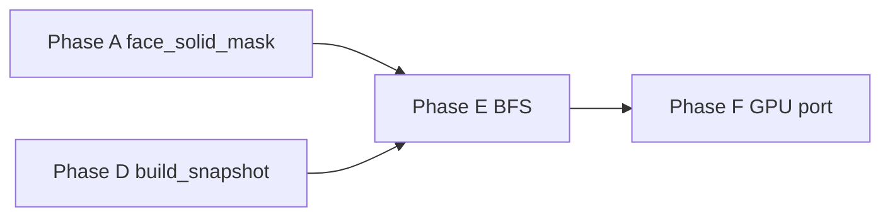

# Phase E — Connectivity Occlusion (Draw Culling) — Design

**Status:** Implemented (2026-06-04) — `f3f337f`, `1a37719`
**Roadmap:** `2026-06-04-rendering-performance-roadmap-design.md` (Phase E)
**Bezug:** Phase A (`SectionRenderMeta`, `section_fully_occluded`), Phase D (`build_snapshot` LOD0/LOD1), `2026-06-03-voxel-engine-design.md` §5 (Snapshot), §13 (Renderer)

## Ziel

Terrain-Sections, die **nicht luftseitig mit der Kamera-Section verbunden** sind, nicht zeichnen — auch wenn Frustum und Draw-Distanz sie einschließen. Typischer Gewinn: vergrabene Höhlenkerne, Innenraum hinter geschlossenen Bergwänden, isolierte LOD0-Sections in der Mitte von Steinmassen.

**Nicht** dasselbe wie Phase A: A skippt **Mesh-Jobs** für vollständig von Solid umschlossene opake Sections (0 Faces). Phase E skippt **Draws** für Sections ohne **Konnektivitätspfad** zur Kamera (kann trotzdem Mesh haben).

Erfolgskriterien (manuell):

1. Spieler auf der Oberfläche: große unterirdische Hohlräume ohne Eingang verschwinden aus dem Draw (kein „Röntgen“ durch nahe Wände).
2. Spieler in einer Höhle: verbundene Gänge + Kammer bleiben sichtbar; nach Schließen eines Tunnels wird abgeschnittener Raum unsichtbar.
3. Streaming-Rand / fehlende Nachbarn: **keine** neuen Löcher (konservativ zeichnen).
4. Wasser: Küsten/unter Wasser korrekt (Water-Pass nie weggecullt).
5. ImGui: `connectivity_culled` deutlich > 0 in Berggebiet; Frame-Zeit stabil bei weitem Radius.

---

## Scope

### In Scope (E.1 — Pflicht)

| Thema | Inhalt |
|-------|--------|
| Algorithmus | Section-Graph **BFS** ab Kamera-Section |
| Kanten | **Portal-Heuristik** aus `face_solid_mask` (Phase A), kein Voxel-DDA |
| Consumer | Nur `build_snapshot` (opaque LOD0 + LOD1); Water unverändert |
| Konservativ | Fehlender Nachbar / `pending_unload` / Streaming-edge ⇒ Portal offen |
| Seed | Section, die `focus_world` enthält — immer sichtbar |
| LOD1 | Chunk-Lod1-Draw nur, wenn ≥1 Section im Chunk **sichtbar** |
| Budget | `max_bfs_sections` Cap pro Frame |
| Toggle | `TerrainOcclusionConfig::enabled` (Debug/Perf) |
| Observability | ImGui: visited, culled, BFS truncated |

### In Scope (E.2 — optional Follow-up)

| Thema | Inhalt |
|-------|--------|
| Mesh-Scheduling | `schedule_section_mesh` skip für connectivity-culled + stabil (kein sichtbarer Wechsel) |
| Feiner Portal-Grid | 4×4 oder 16×16 Passability-Bits pro Face (weniger False-Disconnection) |

### Out of Scope

- **Hi-Z / GPU occlusion queries** → Phase F
- **Audio `OcclusionGrid`** (DDA 1 m) — bleibt separat; kein Code-Sharing nötig in E.1
- Voxel-level BFS durch alle 4096 Zellen/Section
- Occlusion für Character-Pass / Entities
- Persistenz / MP-Sync von Visibility
- `section_fully_occluded` ändern (Phase A bleibt für Mesh-Skip)

---

## E0. Voraussetzung Phase A (Blocker-Gate)

Phase E hängt **vollständig** an korrektem `face_solid(section.render_meta, face)` ⇔ `face_solid_mask`.

**Pflicht vor E-Implementierung:** `face_solid_mask` für **jede nicht-leere** Section berechnen — **nicht** nur bei `is_opaque_full`. Sonst sind gemischte Sections fälschlich „Portal überall“ → fast kein Culling-Gewinn, aber auch selten echte Löcher.

**IST-Audit (2026-06-04):** `Section::recompute_render_meta()` scannt `face_solid_mask` für alle nicht-leeren Sections (voller Pfad Zeilen 131–135 in `Section.hpp`). Phase-A-Spec-Erratum ist im Code **bereits** umgesetzt.

**Gate-Tests (müssen grün bleiben / vor E-Start laufen):**

- `tests/world/test_section_render_meta.cpp` — „mixed section sets only solid face bits“ (`Face::NY` solid, `Face::PY` nicht)
- Kein Regressionstest, der `face_solid_mask` nur bei `is_opaque_full` setzt

Wenn ein älter Branch das noch falsch macht: **zuerst Phase A fixen**, dann E.

---

## E0b. Ist (nach A–D)

| Mechanismus | Wirkung |
|-------------|---------|
| Frustum + Distanz | `build_snapshot` pro Section/Chunk |
| Phase A `occluded_skip` | Kein Mesh, kein Draw |
| Phase D LOD1 | Chunk-Draw statt 8 Sections |
| Phase A `face_solid_mask` | Für alle nicht-leeren Sections; bisher nur Mesh-Occlusion-Consumer |

---

## E1. Phase A vs. Phase E

| | Phase A | Phase E |
|---|---------|---------|
| Frage | „Erzeugt diese Section überhaupt Faces?“ | „Kann die Kamera diese Section **durch Luft/Wasser** erreichen?“ |
| Test | Alle 6 Nachbar-**Faces** opak | BFS über Section-Portale |
| Wann | Mesh-Schedule | Draw (`build_snapshot`) |
| Wasser | `is_empty` wenn nur Luft | Wasser = passierbar; Draw **nie** cullen |
| Nachbar fehlt | nicht occluded (render) | Portal **offen** (render) |

Beide können auf derselben Section greifen: A verhindert Mesh; E verhindert Draw für Sections mit Mesh, die graph-theoretisch isoliert sind.

---

## E2. Section-Portal (Kante)

Eine **Kante** zwischen Section `A` (Face `f`) und Nachbar-Section `B` existiert, wenn ein Spieler die gemeinsame Fläche **ohne durchgehende 16×16-Opakwand** passieren könnte (heuristisch):

```cpp
inline bool section_face_has_portal(const SectionRenderMeta& m, Face f) {
    return !face_solid(m, f);  // mindestens eine nicht-opake Zelle auf der 16×16-Randschicht
}

bool sections_connected_portal(
    const SectionRenderMeta& a, Face face_from_a,
    const Section* neighbor_b) {
    if (neighbor_b == nullptr) {
        return true;  // konservativ: Nachbar unbekannt → nicht abschneiden
    }
    const Face opp = opposite_face(face_from_a);
    return section_face_has_portal(a, face_from_a)
        || section_face_has_portal(neighbor_b->render_meta, opp);
}
```

**Begründung:** Nur wenn **beide** Seiten `face_solid` sind, ist die Schnittfläche dicht — keine Kante. Einseitiges Loch reicht (Tunnel 1×1 auf der Fläche).

**False Positive (bewusst, E.1 OK):** A hat irgendwo ein Loch in der Face-Schicht, B nicht an derselben Stelle — Heuristik sagt trotzdem „verbunden“. Mehr Draws, **keine** sichtbaren Löcher. E.2 (4×4 / 16×16 Portal-Grid) verfeinert.

**Limitation:** Einziger Durchgang kleiner als Heuristik — selten; E.2.

---

## E3. BFS — Sichtbarkeitsmenge

### Section-Key

```cpp
struct SectionVisKey {
    ChunkCoord coord{};
    uint8_t section_index = 0;
};
// Hash + equality für unordered_set oder dense cache index
```

### Seed — `section_key_from_world`

```cpp
// Pflicht: glm::floor auf Welt-Blöcke — NICHT C-Cast-Truncation (negative Koordinaten!)
inline SectionVisKey section_key_from_world(glm::vec3 focus_world) {
    const glm::ivec3 block{
        static_cast<int>(glm::floor(focus_world.x)),
        static_cast<int>(glm::floor(focus_world.y)),
        static_cast<int>(glm::floor(focus_world.z)),
    };
    const BlockPos pos = BlockPos::from_world_blocks(block.x, block.y, block.z);
    return { pos.chunk, static_cast<uint8_t>(section_index(pos.section.x, pos.section.y, pos.section.z)) };
}
```

**Pflicht-Tests** (Chunk-Grenzen + negative Welt):

| `focus_world` | Erwartung (Beispiel) |
|---------------|----------------------|
| `(0, 0, 0)` | Chunk `(0,0,0)`, Section je nach Y/Z-Hälfte |
| `(31.9, 0, 31.9)` | noch Chunk `(0,0,0)` |
| `(32.0, 0, 32.0)` | Chunk `(1,0,1)` |
| `(-0.1, 0, -0.1)` | Chunk `(-1,0,-1)` (floor, nicht 0) |
| `(-32.0, 0, -32.0)` | Chunk `(-1,0,-1)` |

- Wenn Seed-Chunk nicht geladen: `skipped_no_seed=true` → **ganzer Snapshot ohne Connectivity-Cull**.
- Seed-Section immer in `visible_set` (auch wenn `is_empty`).

### Expansion

```
queue ← seed
visible ← { seed }
while queue not empty && |visible| < max_bfs_sections:
    pop A
    for face in 6:
        resolve neighbor section B (neighbor_section, gleiche Logik wie Phase A)
        if B chunk pending_unload: treat portal open, enqueue B if in loaded set
        if !sections_connected_portal(A.meta, face, B): continue
        if B not in loaded mesh radius: continue  // optional: nur innerhalb kMeshChunkRadius
        if B not in visible: enqueue B
```

**Passierbarkeit innerhalb einer Section:** nicht modelliert (Section ist Knoten). Hohlräume **innerhalb** einer Section sind immer „sichtbar“, wenn die Section erreicht wurde (Mesh zeigt innere Faces ohnehin).

### Konservativ-Regeln (immer zeichnen)

| Regel | Verhalten |
|-------|-----------|
| `skipped_no_seed` | Connectivity-Cull **aus** (ganzer Snapshot) |
| `truncated` (BFS-Cap) | Connectivity-Cull **aus** (ganzer Snapshot) — sicherste Variante |
| Seed-Section | immer in `visible` wenn BFS läuft |
| **Streaming-edge-Chunk** (`chunk_requires_lod0_streaming_edge`) | **Kein** Connectivity-Cull für **alle** opaque LOD0-Sections **und** LOD1-Draw dieses Chunks |
| Water-Draw-Pass | **nie** connectivity-cullen |
| `empty_skip` / `occluded_skip` | bereits kein Draw |

**Streaming-Rand knallhart:** Fehlender Nachbar / `pending_unload` darf eine Section in der BFS als „unreachable“ erscheinen, obwohl der später geladene Nachbar ein Portal wäre. Deshalb: **ganzer Chunk** bei Streaming-edge von E ausgenommen — nicht nur einzelne Sections per BFS-Heuristik.

### Zentrale Draw-Entscheidung (Pflicht — kein direktes `!visible.contains`)

```cpp
[[nodiscard]] inline bool connectivity_culling_active(const SectionVisibilityResult& v) {
    return v.ran_bfs && !v.skipped_no_seed && !v.truncated;
}

[[nodiscard]] inline bool connectivity_allows_draw(
    const SectionVisibilityResult& visibility,
    SectionVisKey key) {
    if (!connectivity_culling_active(visibility)) {
        return true;
    }
    return visibility.visible.contains(key);
}
```

`SectionVisibilityResult` ergänzt um `bool ran_bfs = false` (unterscheidet „disabled“ vs „leer“).

**Verboten:** Bei `truncated == true` einzelne Sections per `!visible.contains` wegwerfen — das wäre falsches Cullen nur wegen BFS-Limit.

### Opaque LOD0

In `append_lod0_opaque_draws`, nach Frustum/Distanz:

```cpp
if (chunk_requires_lod0_streaming_edge(store, coord)) {
    // draw — no connectivity skip for this chunk
} else if (!connectivity_allows_draw(visibility, {coord, section_index})) {
    ++connectivity_culled_sections_; continue;
}
```

### Opaque LOD1

```cpp
if (chunk_requires_lod0_streaming_edge(store, coord)) {
    // emit_lod1 as today — no connectivity filter
} else if (connectivity_culling_active(visibility)) {
    bool any_visible = false;
    for (si = 0..7) if (visibility.visible.contains({coord, si})) { any_visible = true; break; }
    if (!any_visible) skip LOD1 chunk draw;
}
```

---

## E4. Modul & API

Neue Dateien (Vorschlag):

```
engine/render/SectionVisibility.hpp
engine/render/SectionVisibility.cpp
```

```cpp
struct TerrainOcclusionConfig {
    bool enabled = true;
    int  max_bfs_sections = 4096;
};

struct SectionVisibilityResult {
    std::unordered_set<SectionVisKey, ...> visible;
    int  visited_count   = 0;
    bool ran_bfs         = false;
    bool truncated       = false;
    bool skipped_no_seed = false;
};

SectionVisibilityResult compute_section_visibility(
    const ChunkStore& store,
    glm::vec3 focus_world,
    int mesh_chunk_radius_chunks,
    TerrainOcclusionConfig config);
```

`StreamingTerrainSystem::build_snapshot` ruft einmal pro Snapshot `compute_section_visibility` auf (mit `focus_world_`, `kMeshChunkRadius`).

**Kein** `ChunkStore*`-Pointer im `WorldRenderSnapshot` — nur bool-Lookup zur Build-Zeit.

---

## E5. Performance

| Knob | Default | Rolle |
|------|---------|-------|
| `max_bfs_sections` | 8192 (Medium/High) | Hard cap visited; bei Cap → `truncated` → **Cull aus** |
| `enabled` | true | Debug off → `ran_bfs=false` |

Komplexität: O(visited × 6). Offene Oberfläche bei großem `lod1_far` kann viele Sections besuchen — **4096 war zu knapp** als Default.

Preset:

| Preset | `max_bfs_sections` |
|--------|-------------------|
| Low | 4096 |
| Medium | 8192 |
| High | 16384 |

**ImGui-Pflicht:** `connectivity_visible_sections`, `connectivity_bfs_truncated`, `connectivity_culled_sections`. Wenn `truncated` **dauerhaft** true → Cap erhöhen oder Suchraum begrenzen; sonst bringt E kaum Gewinn (Cull ist dann deaktiviert).

---

## E6. Invalidierung

E.1: **kein** persistenter Visibility-Cache — BFS pro `build_snapshot`. Block-Änderungen wirken nächstes Frame automatisch.

E.2 (optional Cache): dirty-Region bei `ChunkDirty` — nur wenn Profiling BFS zu teuer wird.

---

## E7. Tests (Catch2)

| # | Test |
|---|------|
| 1 | `section_face_has_portal`: volle Face → false; eine Luft-Zelle auf Rand → true |
| 2 | Beide Faces solid → `sections_connected_portal` false |
| 3 | A Portal, B solid → connected true |
| 4 | `neighbor == nullptr` → connected true |
| 5 | Zwei Sections nur durch offene Face verbunden → BFS von Seed in B erreicht B |
| 6 | Zwei Sections durch doppelte solid Face getrennt → B nicht erreicht |
| 7 | Seed-Section immer visible |
| 8 | `section_key_from_world` — 5 Fokus-Punkte inkl. negative Koordinaten (floor) |
| 9 | `max_bfs_sections = 1` mit Kette → `truncated`; `connectivity_allows_draw` == true für alle Keys |
| 10 | Headless: `build_snapshot` — isolierte Section in Frustum, BFS ok → nicht in `opaque_sections` |
| 11 | Water-Section → noch in `water_sections` |
| 12 | Streaming-edge-Chunk: opaque LOD0 + LOD1 trotz „unreachable“ BFS gezeichnet |
| 13 | Regression: `test_section_render_meta` mixed faces, Phase A occlusion, Phase D |

Tests in `tests/render/test_section_visibility.cpp` + `tests/world/test_section_portal.cpp`.

---

## E8. Observability

ImGui (neben `occluded_skip` / `lod1_draw_chunks`):

- `connectivity_visible_sections` (visited count)
- `connectivity_culled_sections` (opaque skips this frame)
- `connectivity_bfs_truncated` (bool oder counter)

---

## E9. Abhängigkeiten



Phase F portiert dieselbe Sichtbarkeitsmenge (oder Portal-Bits) in Compute/indirect args.

---

## E10. Nicht-Ziele

Siehe Out of Scope. Insbesondere: keine Änderung an GreedyMesher, `TerrainVertex`, oder Audio-Occlusion.

---

## E11. Entscheidungen (rev. 3)

| Frage | Default in E.1 |
|-------|----------------|
| Phase A `face_solid_mask` | Gate-Test vor E; IST-Code ok |
| `truncated` | **Ganzer Snapshot** ohne Connectivity-Cull |
| Draw-Check | Nur `connectivity_allows_draw()` — nie rohes `!visible.contains` |
| Streaming-edge | LOD0 **und** LOD1 des Chunks ausgenommen |
| Wasser in BFS? | Ja — passierbar; Draw nie cullen |
| BFS über unloaded neighbor? | Portal offen beim Expand; Chunk trotzdem streaming-edge-Regel |
| Mesh skip für culled? | **Nein** (E.2) |
| Default BFS cap | 8192 (High 16384) |

---

## Freigabe

Implemented per `docs/superpowers/plans/2026-06-04-phaseE-connectivity-occlusion.md` (Tasks 0–5).

**Parallel optional:** `phaseD` D.2 Far-Impostors — eigene Mini-Spec, unabhängig von E.